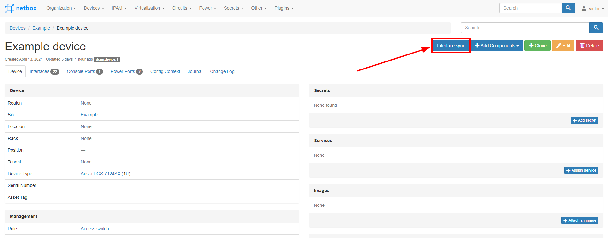

# netbox-interface-sync
[Русская версия](./README_ru.md)
## Overview
This plugin allows you to compare and synchronize interfaces between devices and device types in NetBox. It can be useful for finding and correcting inconsistencies between interfaces.  
Tested with NetBox versions 2.10, 2.11
## Installation
If your NetBox installation uses virtualenv, activate it like this:
```
source /opt/netbox/venv/bin/activate
```
Install the plugin from PyPI:
```
pip install netbox-interface-sync
```
or clone this repository, then go to the folder with it and install the plugin:
```
pip install .
```
To enable to plugin, add the plugin's name to the `PLUGINS` list in `configuration.py` (it's usually located in `/opt/netbox/netbox/netbox/`) like so:
```
PLUGINS = [
    'netbox_interface_sync'
]
```
Don't forget to restart NetBox:
```
sudo systemctl restart netbox
```
## Usage
To compare the interfaces, open the page of the desired device and find the "Interface sync" button:

Mark the required actions with the checkboxes and click "Apply".

### Plugin settings
If you want to override the default values, configure the `PLUGINS_CONFIG` in your `configuration.py`:
```
PLUGINS_CONFIG = {
    'netbox_interface_sync': {
        'exclude_virtual_interfaces': True
    }
}
```
| Setting | Default value | Description |
| --- | --- | --- |
| exclude_virtual_interfaces | `True` | Exclude virtual interfaces (VLANs, LAGs) from comparison
